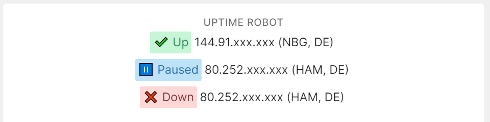

# A tile to display Uptime Robot monitors

[](https://packagist.org/packages/vinevax/laravel-dashboard-uptime-robot-tile)
[](https://packagist.org/packages/vinevax/laravel-dashboard-uptime-robot-tile)

This tile can be used on [the Laravel Dashboard](https://docs.spatie.be/laravel-dashboard).



## Installation

You can install the package via composer:

```bash
composer require vinevax/laravel-dashboard-uptime-robot-tile
```

## Usage

In the `dashboard` config file, you must add this configuration in the `tiles` key.
`````php
// in config/dashboard.php

return [
    // ...
    'tiles' => [
        'uptimerobot' => [
            'key' => env('UPTIMEROBOT_KEY')    
        ]   
    ]   
];
`````

In `app/Console/Kernel.php` you should schedule the `VineVax\UptimeRobotTile\Commands\FetchUptimeRobotDataCommand` to run every `x` minutes.

````php
    // in app/console/Kernel.php
    
        protected function schedule(Schedule $schedule)
        {
            $schedule->command(VineVax\UptimeRobotTile\Commands\FetchUptimeRobotDataCommand::class)->everyFiveMinutes();
        }
````

In your dashboard view you use the `livewire:uptime-robot-tile` component.

```html
<x-dashboard>
    <livewire:uptime-robot-tile position="b1" />
</x-dashboard>
```

### Customizing the view

If you want to customize the view used to render this tile, run this command:

```bash
php artisan vendor:publish --provider="VineVax\UptimeRobotTile\UptimeRobotTileServiceProvider" --tag="dashboard-uptime-robot-tile-views"
```

## Changelog

Please see [CHANGELOG](CHANGELOG.md) for more information on what has changed recently.

## Contributing

Please see [CONTRIBUTING](CONTRIBUTING.md) for details.

## Credits

- [VineVax](https://github.com/vinevax)
- [All Contributors](../../contributors)

## License

The MIT License (MIT). Please see [License File](LICENSE.md) for more information.
