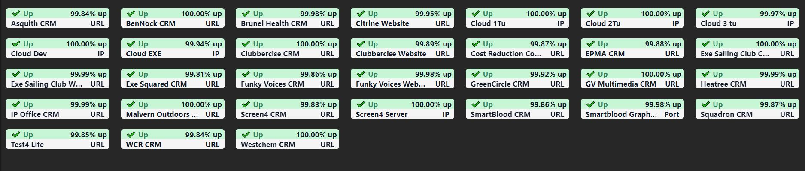

# A tile to display Uptime Robot monitors

[](https://packagist.org/packages/vinevax/laravel-dashboard-uptime-robot-tile)
[](https://packagist.org/packages/vinevax/laravel-dashboard-uptime-robot-tile)

This tile can be used on [the Laravel Dashboard](https://docs.spatie.be/laravel-dashboard).

Original view...


Alternative view for many monitors...



## Installation

You can install the package via composer:

```bash
composer require vinevax/laravel-dashboard-uptime-robot-tile
```

### ⚠️ Important if you want to use the alternative view
In order to use the alternative view, you need to update the included Alpine.js script from version ```2``` to ```3```. To do this, remove the old script in your ```dashboard.php``` config file and add the following script ```https://unpkg.com/alpinejs@3.x.x/dist/cdn.min.js``` 

## Usage

In the `dashboard` config file, you must add this configuration in the `tiles` key.
`````php
// in config/dashboard.php

return [
    // ...
    'tiles' => [
        /* Monitors should be an array with ids of your monitors you want to display */
        'uptimerobot' => [
            'key' => env('UPTIMEROBOT_KEY'),
            'blade' => 'multiple', // Or `multiple` for alternative tile
            'monitors' => [],
            'monitor_types' => [
                1 => 'URL',
                2 => 'Keyword',
                3 => 'Ping',
                4 => 'Port',
                5 => 'Heartbeat'
            ],
            'uptime' => 1 // Set to 0 if fetching from Uptime Robot API lags
        ]   
    ]   
];
`````

In `app/Console/Kernel.php` you should schedule the `VineVax\UptimeRobotTile\Commands\FetchUptimeRobotDataCommand` to run every `x` minutes.

````php
    // in app/console/Kernel.php
  
        protected function schedule(Schedule $schedule)
        {
            $schedule->command(\VineVax\UptimeRobotTile\Commands\FetchUptimeRobotDataCommand::class)->everyFiveMinutes();
        }
````

In your dashboard view you use the `livewire:uptime-robot-tile` component.

```html
<x-dashboard>
    <livewire:uptime-robot-tile position="b1" />
</x-dashboard>
```

### Customizing the view

If you want to customize the view used to render this tile, run this command:

```bash
php artisan vendor:publish --provider="VineVax\UptimeRobotTile\UptimeRobotTileServiceProvider" --tag="dashboard-uptime-robot-tile-views"
```

Please note that if you have published the view and then wish to switch between 'original' and 'multiple' options 
for the blade file in dashboard.php you will need to remove tile.blade.php from 
/resources/views/vendor/dashboard-uptime-robot-tile and then run the publish command again.

## Changelog

Please see [CHANGELOG](CHANGELOG.md) for more information on what has changed recently.

## Contributing

Please see [CONTRIBUTING](CONTRIBUTING.md) for details.

## Credits

- [VineVax](https://github.com/vinevax)
- [All Contributors](../../contributors)

## License

The MIT License (MIT). Please see [License File](LICENSE.md) for more information.
